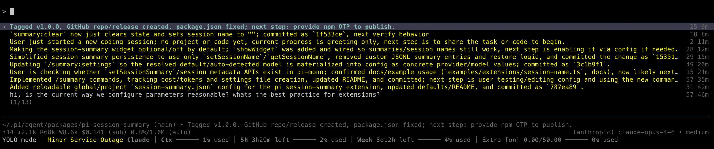

# pi-session-summary

A pi extension that dynamically maintains a one-line LLM-generated session summary, set as the session name so it appears in pi's status bar and `/resume` session list.



Model is auto-detected from available cheap models (gpt-5.4-nano, gpt-5.4-mini, gemini-3-flash, claude-4-5-haiku), or can be configured explicitly.

## Install

```bash
pi install /path/to/pi-session-summary
```

Or add to `settings.json`:

```json
{
  "packages": ["/path/to/pi-session-summary"]
}
```

## Commands

| Command | Description |
|---------|-------------|
| `/summary:settings` | Creates the global settings JSON file (`~/.pi/agent/session-summary.json`) with defaults if it doesn't exist, and shows instructions to edit it. Run `/reload` after editing. |
| `/summary:update` | Force an immediate summary update, bypassing the debounce timer. |
| `/summary:clear` | Reset the summary to the first line of the first user message, clearing all accumulated state. |
| `/summary:cost` | Show the summary model name, number of LLM calls, token usage, and cost breakdown for the current session. |

## Configuration

Create `~/.pi/agent/session-summary.json` (global) or `.pi/session-summary.json` (project override). Project settings are merged on top of global settings, which are merged on top of defaults. Config is reloaded on session start/switch and `/reload`.

All fields are optional — only specify what you want to override:

```json
{
  "provider": "openai-codex",
  "model": "gpt-5.4-mini",
  "debounceSeconds": 120,
  "maxTokens": 300,
  "resummarizeTokenThreshold": 40000,
  "showWidget": false
}
```

| Setting | Default | Description |
|---------|---------|-------------|
| `provider` | *(auto-detect)* | Model provider |
| `model` | *(auto-detect)* | Model ID |
| `debounceSeconds` | `120` | Min seconds between LLM calls |
| `maxTokens` | `300` | Max tokens for LLM response |
| `resummarizeTokenThreshold` | `40000` | Token threshold for full re-summarize vs incremental update |
| `showWidget` | `false` | Show a belowEditor widget with summary, staleness, and compaction info |
